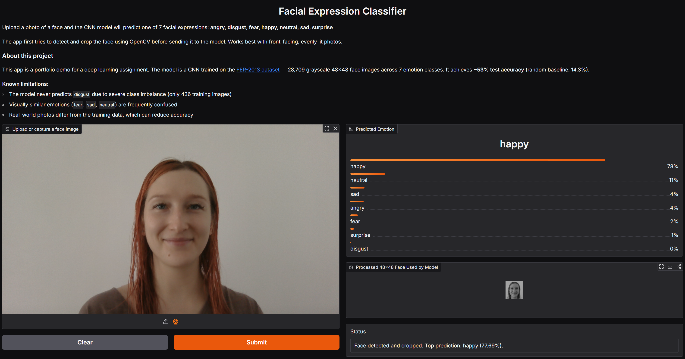
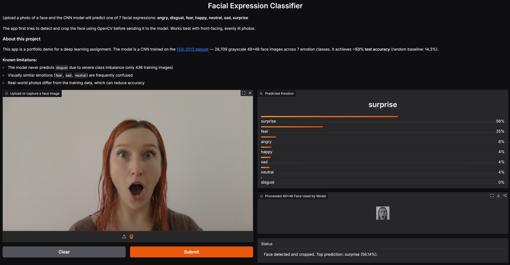
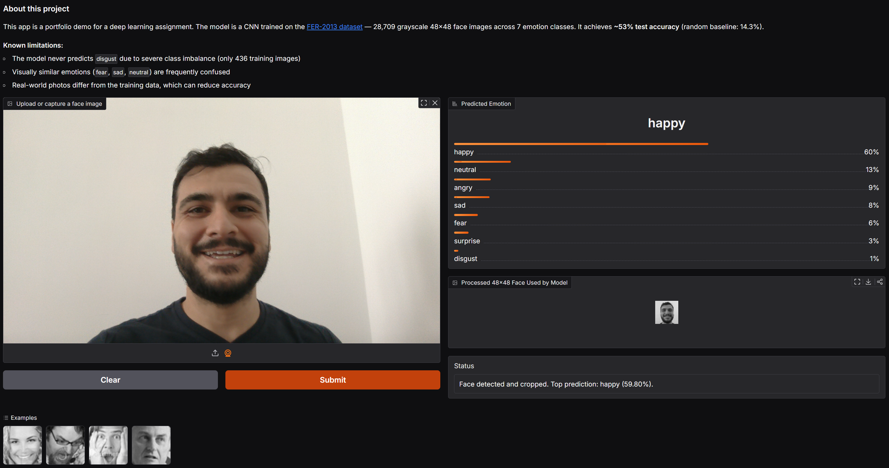
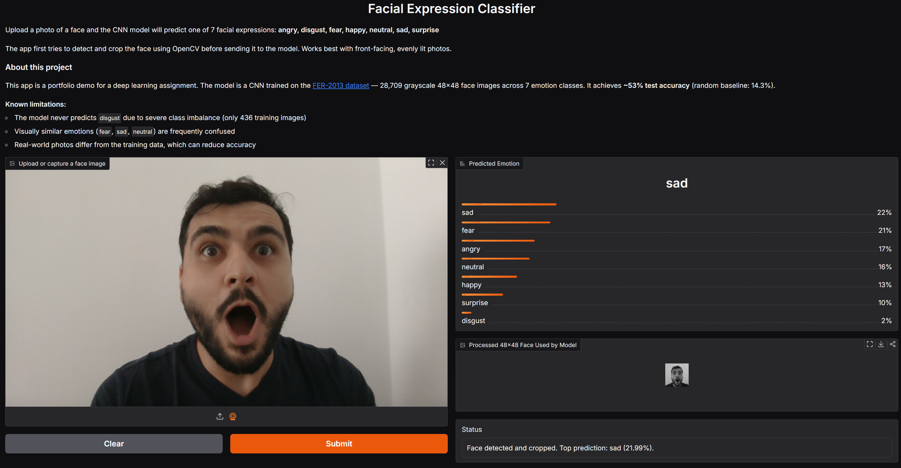

# Facial Expression Classifier

A deep learning project that classifies human facial expressions into 7 emotion 
categories using a Convolutional Neural Network (CNN) trained on the FER-2013 dataset.

Built as part of a Data Science education assignment. The assignment was given in Swedish 
but the project is documented in English to make it accessible as a portfolio piece.

## Overview

The model classifies grayscale 48x48 face images into one of 7 emotions:
`angry`, `disgust`, `fear`, `happy`, `neutral`, `sad`, `surprise`

**Final model performance:** 52.8% test accuracy (random baseline: 14.3%)

## Demo

### My predictions — high confidence
The model predicted my expressions correctly and with high confidence.


*Happy — predicted correctly at 78%*


*Surprise — predicted correctly at 56%*

### Testing on a different person
Testing on my husband showed noticeably lower confidence scores,
likely due to his beard, darker complexion, and different facial structure.
This reflects a known limitation of the FER-2013 dataset — it may not 
represent all demographics equally.


*Happy — predicted correctly but at lower confidence (60%)*


*Surprise — misclassified as sad (22%) — the model was uncertain, 
with probabilities spread across sad (22%), fear (21%), angry (17%) and neutral (16%)*

The app includes:
- Face detection using OpenCV — automatically crops the face before prediction
- Confidence scores for all 7 emotions
- Preview of the 48x48 processed face sent to the model
- Webcam support for live predictions
- Status message indicating whether a face was detected

## Run the App

```bash
source venv/Scripts/activate  # Windows
python app.py
```

Opens at `http://127.0.0.1:7860`.

- **Upload mode:** upload any photo of a face
- **Webcam mode:** capture directly from your camera
- The app automatically detects and crops the face using OpenCV before prediction

## Project Structure

facial-expression-classifier/
├── facial_expression_classifier.ipynb  # main notebook — code + analysis
├── app.py                              # Gradio web app with OpenCV face detection
├── model/
│   ├── facial_expression_model.keras   # saved trained model
│   ├── history3.json                   # training history iteration 3
│   └── history3b.json                  # training history iteration 3b
├── examples/                           # sample images used in the app
│   ├── happy.jpg
│   ├── angry.jpg
│   ├── sad.jpg
│   └── surprise.jpg
├── screenshot.png                      # app demo — me happy prediction
├── screenshot2.png                     # app demo — husband happy prediction
├── screenshot3.png                     # app demo — me surprise prediction
├── screenshot4.png                     # app demo — husband surprised prediction
├── .gitignore
├── requirements.txt
└── README.md

## What the Notebook Covers

1. **Data exploration** — class distribution, sample images, data quality observations
2. **Data preparation** — normalization, train/validation split, pipeline setup
3. **Model building** — CNN architecture with Conv2D, BatchNorm, Dropout layers
4. **Training** — 3 iterations with documented reasoning, early stopping, training curves
5. **Evaluation** — accuracy, F1-score, confusion matrix, per-class analysis
6. **Predictions** — inference on unseen images with confidence scores
7. **Analysis** — overfitting diagnosis, limitation discussion, class imbalance
8. **Reflection** — lessons learned, what would be done differently

## Key Findings

- Class imbalance significantly affects performance — `disgust` (436 images) is never 
  predicted correctly while `happy` (7,215 images) achieves F1: 0.77
- Iteration 3 (BatchNorm + Dropout + Augmentation) reduced the train/val accuracy gap 
  from 18% to 6%, indicating better generalization
- Visually similar emotions (`fear`, `sad`, `neutral`) are frequently confused
- The app works better on real photos than raw model evaluation suggests, thanks to 
  OpenCV face detection and cropping

## Known Limitations

- The model never predicts `disgust` due to severe class imbalance in the training data
- Visually similar emotions (`fear`, `sad`, `neutral`) are frequently confused
- Performance varies across individuals — facial features like beards, glasses, 
  or lighting conditions can reduce accuracy
- The FER-2013 dataset may not represent all demographics equally, which can affect 
  generalization across different people
- Trained on grayscale 48×48 images — low resolution limits available features
- Webcam predictions may be less reliable than uploaded photos due to differences 
  from training data conditions

## Dataset

[FER-2013](https://www.kaggle.com/datasets/msambare/fer2013) — not included in this 
repository due to size (60MB). Download and place in:

C:/your/path/FER-2013/
├── train/
│   ├── angry/
│   ├── disgust/
│   └── ...
└── test/
└── ...

Update the `TRAIN_DIR` and `TEST_DIR` paths in the notebook accordingly.

## Setup

```bash
git clone https://github.com/elzacapar/facial-expression-classifier
cd facial-expression-classifier
python -m venv venv
source venv/Scripts/activate  # Windows
pip install -r requirements.txt
```

Then open `facial_expression_classifier.ipynb` in VS Code or Jupyter.

## Tech Stack

- Python 3
- TensorFlow / Keras
- OpenCV
- NumPy, Pandas
- Matplotlib, Seaborn
- scikit-learn
- Pillow
- Gradio
